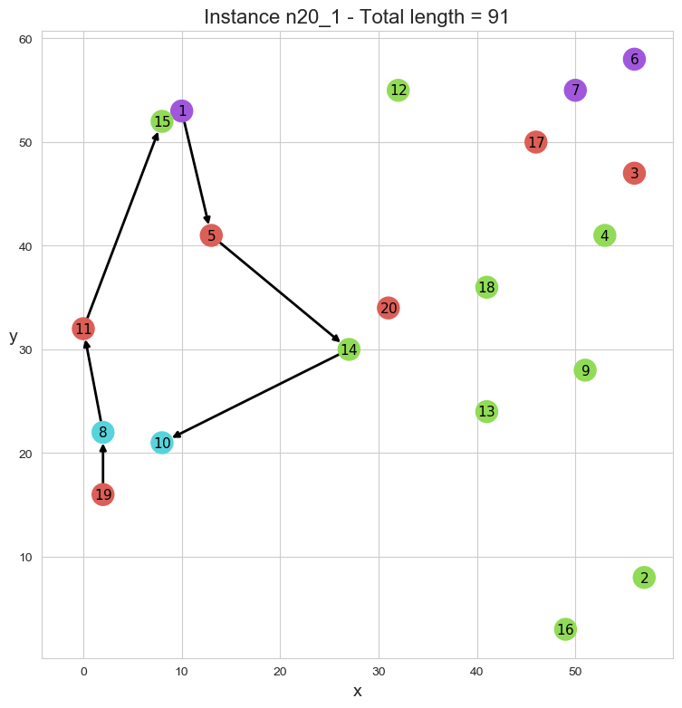

# Flight route optimizer

Route optimizer based on a variant of the Traveling Salesman Problem where:
- we aim at finding a path whose extremities are imposed;
- by minimizing the total traveled distance;
- there is a lower bound on the number of vertices to visit;
- the distance between two consecutive vertices must not exceed a certain threshold value;
- groups of vertices are predefined and each group must be visited at least once to ensure some geographical diversity.

> More details about the modeling and the solution methods are available [here](https://antcrepin.github.io/posts/flight-route-optimizer).

<p align="center">
  
</p>
 
## Prerequisite

- Install [Julia](https://julialang.org/downloads/) v1.4.0 or higher, and the following packages
  - JuMP
  - MathOptFormat
  - CPLEX or CBC or GLPK
  - LinearAlgebra
- Install a MIP solver such as [IBM CPLEX Optimizer](https://www.ibm.com/analytics/cplex-optimizer) (commercial) or [CBC](https://projects.coin-or.org/Cbc) (open source) or [GLPK](https://www.gnu.org/software/glpk/) (open source)
- *(optional, to plot the solutions)* Install [Python](https://www.python.org/downloads/) v3.5 or higher, and the following packages
  - networkx
  - matplotlib
  - seaborn
  - numpy
  - math

## User guide

### Run the code

```
julia ./bin/flight_route_optimizer.jl -i ./data/n50.txt
```

### Options

- ```--external_solver``` / ```-x```: external solver
  - either ```cbc``` or ```cplex``` or ```glpk```
  - default: ```cplex```
- ```--input``` / ```-i```: instance file path
  - default: ```./data/n30.txt```
- ```--method``` / ```-m```: solution method
  - either ```sequential``` or ```single-flow``` or ```std-constr-gen``` or ```adv-constr-gen```
  - default: ```single-flow```
- ```--verbosity``` / ```-v```: verbosity level
  - either 0 or 1 or 2
  - default: 1
- ```--help``` / ```-h```: show help

### Interactive mode

- Open a Julia console
- Set options in **src/args.jl** by modifying default values
- Run
```julia
include("./bin/flight_route_optimizer.jl")
```

### Plot the results

- Edit input data in **./plot/display_solution.py**
- Run
```
python ./plot/display_solution.py
```

## License

This project is licensed under the terms of the MIT license.
